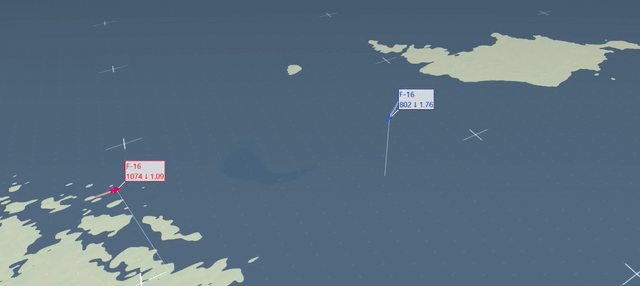

# BVRGym
## Description
This library is heavily based on JSBSim software (https://github.com/JSBSim-Team/jsbsim). 
This library's primary purpose is to allow users to explore Beyond Visual Range (BVR) tactics using Reinforcement learning.

## Environment
The environments above mainly use the F16 flight dynamics and BVR missile models. 
The F16 model has an additional wrapper to control simply, while the BVR missile has a Proportional Navigation guidance law implemented to guide it toward the target.
The following commands are equivalent, but they run the process in parallel to speed up convergence. 
Currently, there are three available environments:

### Evading one missile
Single CPU or multiple CPUs:

python mainBVRGym.py -track t1 -seed 1

python mainBVRGym_MultiCore.py -track M1  -cpus 8 -Eps 100000 -eps 3

### Evading two missile 

python mainBVRGym.py -track t2 -seed 1

python mainBVRGym_MultiCore.py -track M2  -cpus 8 -Eps 100000 -eps 3

### BVR air combat

python mainBVRGym.py -track dog

python mainBVRGym_MultiCore.py -track Dog -cpus 10 -Eps 10000 -eps 1

At the beginning of the training, we see that the Red aircraft effectively shoots down the agent with its first missile (aim1r) but later starts using the second missile as well (aimr2). As the training progresses, the agent starts to utilize their own missiles (aim1) and (aim2), and the running reward illustrates that the agent slowly improves its behavior towards defeating the enemy. Running on 10 CPUs it take less than 4 hours to generate these results.

## Requirments
The following libraries are required to run BVRGym. 
The code has been tested with Python 3.9 

pip install jsbsim geopy pyproj pymap3d torch tensorboard py_trees tqdm

## Getting started 
To plot Aircraft and Missile behavior 

python mainBVRGym.py -track f1 -head 0.0 -alt -1.0 -thr 1.0

## Configuration files
BVR air combat is a relatively complex environment with a large number of variable and non-linear dynamics. 
To change the behavior of the environment, you can modify the configuration files for the corresponding unit or the environment itself.

Environment: jsb_gym/environments/config

Tactical Units: jsb_gym/TAU/config

## Additional details 
Additional details can be found in the following article

BVR Gym: A Reinforcement Learning Environment for Beyond-Visual-Range Air Combat

https://arxiv.org/abs/2403.17533

## FlightGear
FlightGear offers an excellent tool for visualizing the units present in BVR Gym. 
To install FlightGear (Tested on Ubuntu 20.04.6 LTS)

sudo add-apt-repository ppa:saiarcot895/flightgear

sudo apt update

More details on https://launchpad.net/~saiarcot895/+archive/ubuntu/flightgear

In the FlightGear aircraft directory (~ /.fgfs/Aircraft/org.flightgear.fgaddon.stable_2020/Aircraft), you should have the f16 model already present (or just add it in Flightgear in Aircraft/Browse), but not the missile. 
To have a missile model as well, copy the ogel folder from this repo (fg/ogel) to the Flightgears aircraft directory. 
To visualize missile in Flightgear, I used the ogel (1) model within the fgfs, replaced the grapical representations of the ogel with a missile that was available in fgfs (I think it was from (2)) and added a trail from santa claus (3) to see the trajectory. 

1) https://wiki.flightgear.org/Ogel

2) https://forum.flightgear.org/viewtopic.php?t=19930#p183249

3) https://wiki.flightgear.org/Santa_Claus

Given that you have both the f16 and ogel directories in the fgfs directory, you can run the following commands to visualize both units. 

terminal 1: fgfs --fdm=null --native-fdm=socket,in,60,,5550,udp --aircraft=f16-block-52 --airport=ESSA --multiplay=out,10,127.0.0.1,5000 --multiplay=in,10,127.0.0.1,5001

terminal 2: fgfs --fdm=null --native-fdm=socket,in,60,,5551,udp --aircraft=ogel --airport=ESSA --multiplay=out,10,127.0.0.1,5001 --multiplay=in,10,127.0.0.1,5000

And run an example: 

terminal 3: python mainBVRGym.py -track f1 -head 0.0 -alt -1.0 -thr 1.0 -v

In Flightgear, you can use "v" to change view-point, "x" to zoom in, "ctrl + x" to zoom out

Finally, you should be able to see something like this:

## Tacview

Tacview is a flight data analysis tool used to visualize and debrief aerial missions in 2D and 3D, but its not for free. Here are some examples how it looks in tacview for different scenarios. You can find more details on how the flight recording file should look https://www.tacview.net/documentation/csv/en/  

### Evading one missile (Untrained)

### Evading two missile (Untrained)

### BVR air combat (Untrained)

